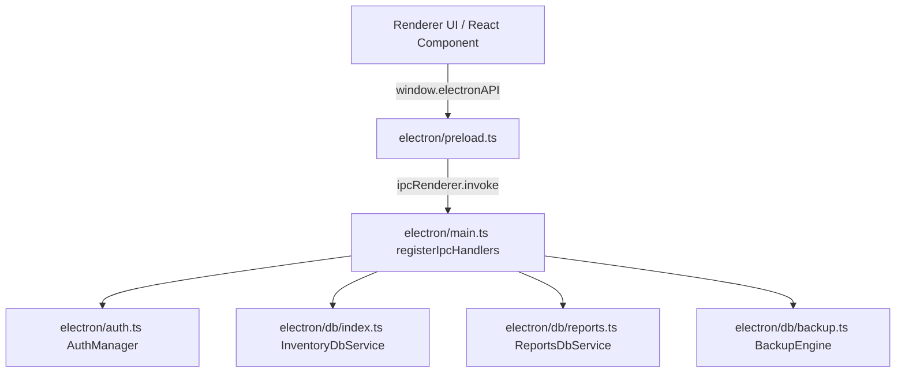

# InventorT Desktop Application — Architecture Map

**Target System**: InventorT Hospital & Pharmacy Inventory Management System  
**Framework**: Electron v33 + React v18 + Vite v6 + SQLite (`better-sqlite3` v11)  
**Main Entry Point**: `dist-electron/main.js` (Compiled from `electron/main.ts`)  
**Preload Bridge**: `dist-electron/preload.js` (Compiled from `electron/preload.ts`)  

---

## 1. BrowserWindow Creations

| Component | Target File | Instantiated Configuration | Purpose | Callers |
| :--- | :--- | :--- | :--- | :--- |
| `mainWindow` | [electron/main.ts](file:///d:/HospitalInventory/electron/main.ts#L290-L348) | `width: 1280`, `height: 800`, `minWidth: 1024`, `minHeight: 700`<br>`nodeIntegration: false`<br>`contextIsolation: true`<br>`sandbox: true`<br>`preload: path.join(__dirname, 'preload.js')` | Primary application window host. | `app.whenReady()`, `app.on('activate')` |

---

## 2. Preload Files & `contextBridge` Surface

- **Preload Script**: [electron/preload.ts](file:///d:/HospitalInventory/electron/preload.ts)
- **Exposed Object**: `window.electronAPI` via `contextBridge.exposeInMainWorld('electronAPI', electronAPI)`

### Exposed API Catalog

| Module | Function | Exposed IPC Channel | Return Type | Access Layer | Privileged / Role Required |
| :--- | :--- | :--- | :--- | :--- | :--- |
| `system` | `ping()` | `system:ping` | `Promise<string>` | System | Public |
| `system` | `getAppVersion()` | `system:version` | `Promise<string>` | System | Public |
| `system` | `checkIntegrity()` | `system:checkIntegrity` | `Promise<any[]>` | Database | Authenticated User |
| `auth` | `getStatus()` | `auth:getStatus` | `Promise<object>` | Auth | Public |
| `auth` | `setupAccounts(payload)` | `auth:setup` | `Promise<object>` | Auth / Database | Initial Setup Only |
| `auth` | `login(credentials)` | `auth:login` | `Promise<object>` | Auth / Database | Public |
| `auth` | `logout()` | `auth:logout` | `Promise<object>` | Auth | Authenticated User |
| `auth` | `changePassword(params)` | `auth:changePassword` | `Promise<object>` | Auth / Database | Authenticated User |
| `suppliers` | `getAll(includeArchived?)` | `suppliers:getAll` | `Promise<any[]>` | Database | Authenticated User |
| `suppliers` | `create(data)` | `suppliers:create` | `Promise<object>` | Database | Authenticated User |
| `suppliers` | `update(data)` | `suppliers:update` | `Promise<object>` | Database | **MASTER Role Required** |
| `suppliers` | `archive(id)` | `suppliers:archive` | `Promise<object>` | Database | **MASTER Role Required** |
| `products` | `getAll(includeArchived?)` | `products:getAll` | `Promise<any[]>` | Database | Authenticated User |
| `products` | `create(data)` | `products:create` | `Promise<object>` | Database | Authenticated User |
| `products` | `update(data)` | `products:update` | `Promise<object>` | Database | **MASTER Role Required** |
| `products` | `archive(id)` | `products:archive` | `Promise<object>` | Database | **MASTER Role Required** |
| `batches` | `getByProduct(productId)` | `batches:getByProduct` | `Promise<any[]>` | Database | Authenticated User |
| `batches` | `getAll()` | `batches:getAll` | `Promise<any[]>` | Database | Authenticated User |
| `purchases` | `getAll()` | `purchases:getAll` | `Promise<any[]>` | Database | Authenticated User |
| `purchases` | `create(input)` | `purchases:create` | `Promise<object>` | Database | Authenticated User (Master Elevation Required if STAFF) |
| `purchases` | `delete(payload)` | `purchases:delete` | `Promise<object>` | Database | **MASTER Role Required** |
| `reports` | `getGstSummary(params)` | `reports:getGstSummary` | `Promise<any[]>` | Database | Authenticated User |
| `reports` | `getExpiryReport()` | `reports:getExpiryReport` | `Promise<any[]>` | Database | Authenticated User |
| `stock` | `exit(data)` | `stock:exit` | `Promise<object>` | Database | Authenticated User |
| `stock` | `getExitHistory()` | `stock:getExitHistory` | `Promise<any[]>` | Database | Authenticated User |
| `backup` | `trigger()` | `backup:trigger` | `Promise<object>` | Filesystem / DB | **MASTER Role Required** |
| `backup` | `getLogs()` | `backup:getLogs` | `Promise<any[]>` | Database | Authenticated User |

---

## 3. Main Process IPC Handler Registrations

Register Function: `registerIpcHandlers()` in [electron/main.ts](file:///d:/HospitalInventory/electron/main.ts#L89-L288)



---

## 4. Authentication & Session Architecture

**Module File**: [electron/auth.ts](file:///d:/HospitalInventory/electron/auth.ts)

- **`setupAccounts(payload)`**: Hashes Master and Staff passwords using `crypto.pbkdf2Sync` (100,000 iterations, 64-byte key, SHA-512, random 16-byte salt per user) and inserts them inside an atomic transaction into `users` table.
- **`login(loginId, password)`**: Verifies credentials against stored salt and hash. Creates in-memory `ActiveUserSession` in `AuthManager`. Tracks failed login attempts in a sliding map (`failedLoginAttempts`) to lock accounts temporarily on repeated failures.
- **`logout()`**: Resets `this.activeSession = null`.
- **`changePassword(params)`**: Validates caller's session. If target is MASTER, verifies current password or MASTER elevation. Computes new salt and hash, updates `users` table.
- **`verifyMasterPassword(password)`**: Authenticates Master Admin password for inline action elevation (e.g. STAFF purchase invoice save).

---

## 5. Database Schema & SQLite Operations

**SQLite Driver**: `better-sqlite3` v11.8.0  
**Database File**: `<userData>/data/inventory.db`  

### Database Services & Modules

1. **`electron/db/schema.ts`**:
   - `initializeDatabaseSchema(db)`: Creates tables `users`, `suppliers`, `products`, `batches`, `purchase_invoices`, `purchase_items`, `stock_exits`, `inventory_ledger`, `backup_logs`, and `audit_logs` with explicit indices (`idx_batches_exp_date`, `idx_ledger_product`, `idx_purchases_supplier_date`).
2. **`electron/db/index.ts`**:
   - `InventoryDbService`: Handles catalog CRUD, purchase invoices with integer paise financial calculations, multi-step inventory ledger reconciliation, and stock exits.
3. **`electron/db/reports.ts`**:
   - `ReportsDbService`: Calculates aggregated GST rate class summaries (0%, 5%, 12%, 18%, 28%) and active batch expiry status.
4. **`electron/db/backup.ts`**:
   - `BackupEngine`: Performs WAL-safe database snapshots using `this.db.backup(targetPath)` and logs backup metrics to `backup_logs`.

---

## 6. Filesystem Operations & Paths

| Path Identifier | Directory / File Location | Operative Module | Purpose |
| :--- | :--- | :--- | :--- |
| Custom `userData` | Passed via CLI `--user-data-dir=` or `%APPDATA%\Hospital Inventory` | [electron/main.ts](file:///d:/HospitalInventory/electron/main.ts#L15-L29) | Overrides Electron application data directory. |
| SQLite Storage | `<userData>/data/inventory.db` | [electron/main.ts](file:///d:/HospitalInventory/electron/main.ts#L42-L47) | Main relational database file created via `fs.mkdirSync(dataDir)`. |
| Database Backups | `<userData>/backups/inventory_backup_*.db` | [electron/db/backup.ts](file:///d:/HospitalInventory/electron/db/backup.ts#L24-L36) | Automated and manual backup snapshot files created via `db.backup()`. |

---

## 7. Navigation & Event Handlers

Location: [electron/main.ts](file:///d:/HospitalInventory/electron/main.ts#L309-L333)

- **`setWindowOpenHandler`**: Intercepts `window.open` requests and returns `{ action: 'deny' }`.
- **`will-navigate`**: Intercepts renderer navigation events and blocks non-`file://` URLs in production builds.
- **`before-input-event`**: Suppresses F12 and Ctrl+Shift+I / Ctrl+Shift+J shortcuts in packaged production builds.

---

## 8. Electron-Builder Configuration

Location: [package.json](file:///d:/HospitalInventory/package.json#L35-L59)

```json
{
  "build": {
    "appId": "com.hospital.inventory",
    "productName": "Hospital Inventory",
    "directories": {
      "output": "release"
    },
    "files": [
      "dist/**/*",
      "dist-electron/**/*"
    ],
    "asar": true,
    "asarUnpack": [
      "**/node_modules/better-sqlite3/build/Release/*"
    ],
    "win": {
      "target": "nsis"
    },
    "nsis": {
      "oneClick": false,
      "allowToChangeInstallationDirectory": true,
      "createDesktopShortcut": true,
      "createStartMenuShortcut": true,
      "shortcutName": "Hospital Inventory"
    }
  }
}
```
